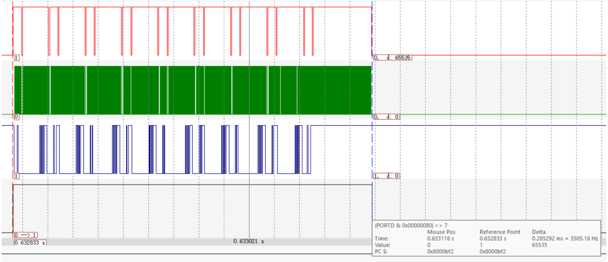
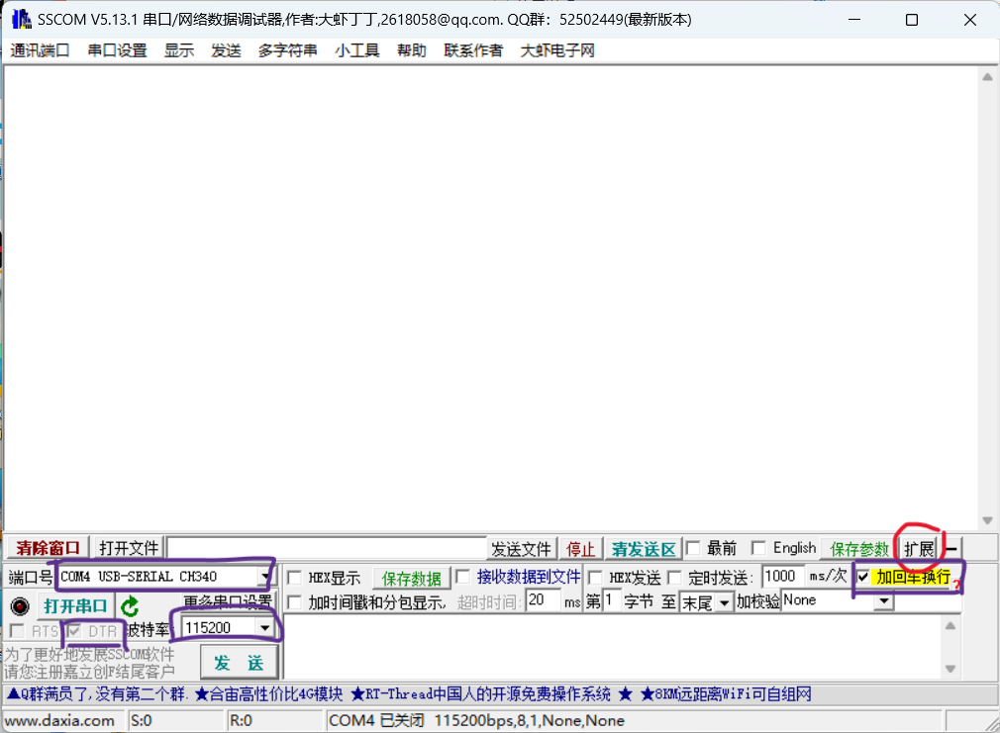
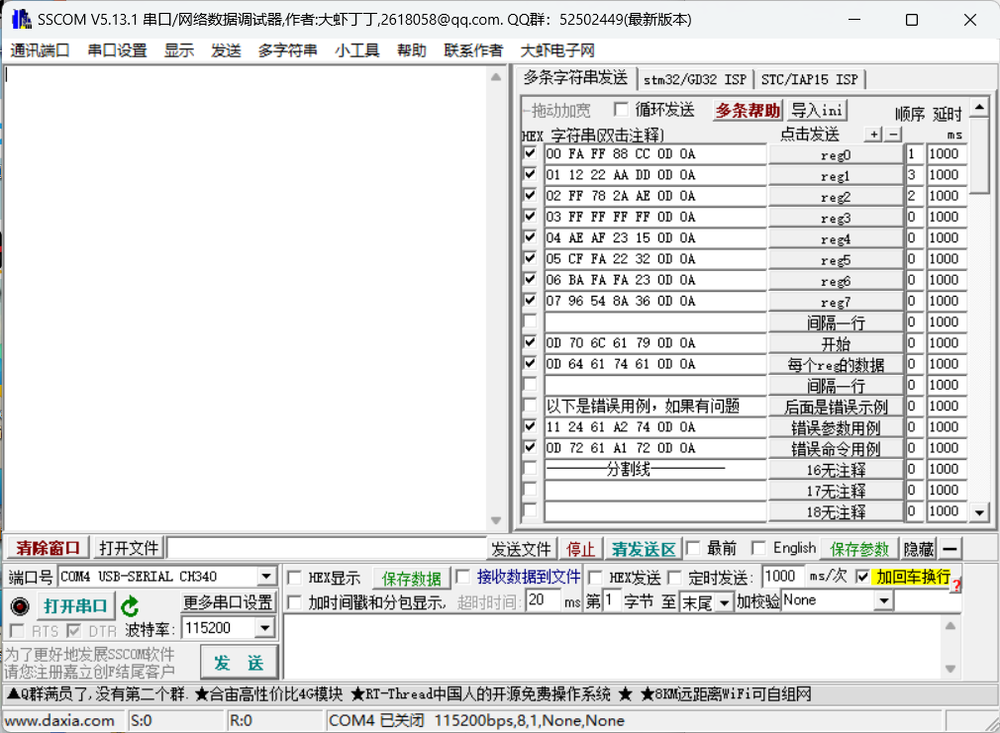
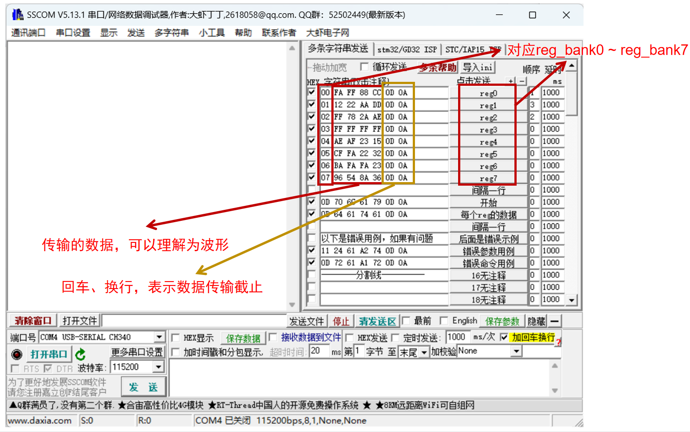

项目是用于自有芯片开发的控制程序，芯片的spi时序参考AD9856。

## 目录结构

```bash
├─doc
├─requestment
│  └─AD7190+SPI 独立引脚
│      └─AD7190+SPI 独立引脚
├─Spi_top
│  ├─BSP
│  │  ├─Inc
│  │  └─Src
│  ├─Core
│  │  ├─Inc
│  │  └─Src
│  ├─Drivers
│  │  ├─CMSIS
│  │  │  ├─Device
│  │  │  │  └─ST
│  │  │  │      └─STM32F1xx
│  │  │  │          ├─Include
│  │  │  │          └─Source
│  │  │  │              └─Templates
│  │  │  └─Include
│  │  └─STM32F1xx_HAL_Driver
│  │      ├─Inc
│  │      │  └─Legacy
│  │      └─Src
│  └─MDK-ARM
│      ├─RTE
│      │  └─_Spi_top
│      └─Spi_top
└─tool
    └─sscom
```

stm32代码在`Spi_top`中。

项目也可用于AD9856 DDS频率合成器。

### 更新

增加了us级别的延迟，波形更整齐，取消了点击`开始`后发送过程和完成的提示，确保波形无延迟。以下是时序图：



## 工具

### FlyMCU

这是个程序下软件，网上有很多教程，就不赘述了。

`.hex`文件目录`SPI_Top\MDK-ARM\SPI_Top\Spi_top.hex`

<p style="color: red;">注意下载完程序要按下板子上黑色的按键。</p>

### sscom

打开`sscom`:



确保紫色部分配置与图中一致。

点击`扩展`：



这部分是由`sscom51.ini`所配置，如果没有内容，可自行导入。

以下是对reg0-7数据格式的解释：



  点击即可发送。

> 提供的Spi_top文档中有reg_bank0到reg_bank15，但代码中仅到reg_bank7，所以默认设置了8个reg，如需要设置更多的reg，需要更改程序。

`间隔一行`后是控制命令，以`0D`开头，接控制信号进和回车换行。如果不喜欢可在代码中`main.c`中修改：

```
#define COMMAND_START 0x706C6179  //开始将启动SPI控制命令
#define COMMAND_DATA 0x64617461		//展示数据命令
```

>  `开始`:通过spi将数据发送出去；
>
> `每个reg的数据`:用于展示将要发送的每个reg_bank的数据。

后面两个是错误数据的用例。

**注意：规定的通信协议都是固定长度（8*7）的16进制数字，结尾一定是`0D 0A`，传输其他格式可能会出现未知的错误。**

<a href= "doc/user_test.mp4">视频链接</a>

<iframe height=498 width=510 src="doc/user_test.mp4">
